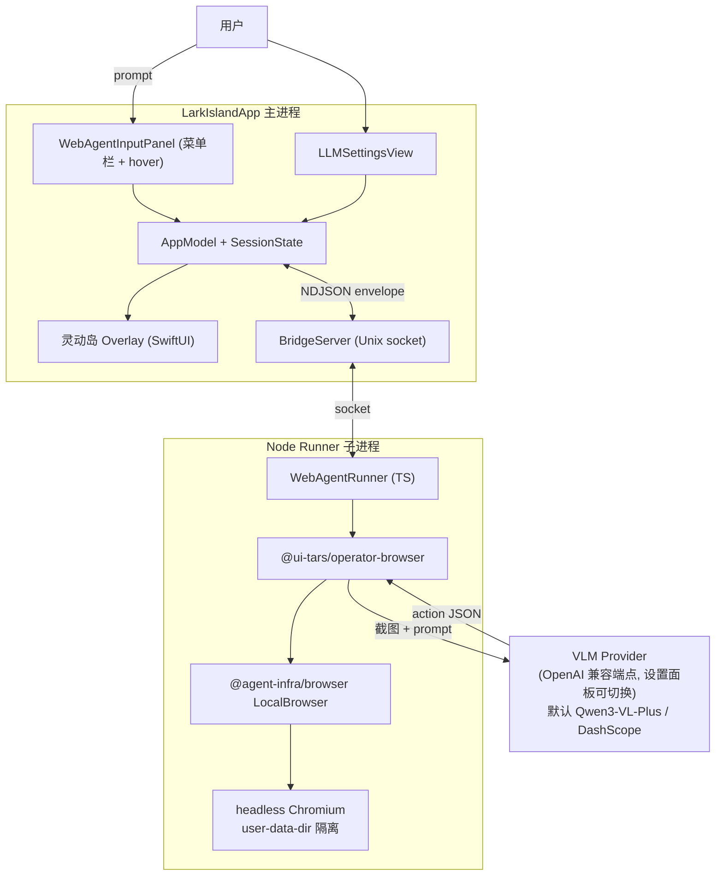

# Lark Island Web Agent Pivot

## 产品定位

Lark Island = 灵动岛 + 浏览器沙箱通用 web agent。形态对标 Manus 的 Mac 桌面入口，但**全本地、无服务器**：

- 用户从灵动岛唤出输入框，说"给张三发条飞书消息"
- runner 子进程 spawn 隔离的 headless Chromium，UI-TARS VLM 看截图、决定动作
- 灵动岛实时显示步骤、缩略图、需要批准时弹审批
- 飞书是首批内置 skill；架构通用（任何能用浏览器干的事都行）

**已拍板的设计决策**：
- LLM 切换边界：仅 OpenAI 兼容端点（Qwen / Doubao / HF / Azure OpenAI），Claude 走 LiteLLM 代理；默认 `qwen3-vl-plus` + DashScope
- 出厂只 1 个 LLM profile（`qwen-default`），用户可在 LLM Settings 自加 Doubao
- 输入入口：MVP 含菜单栏点击 + 灵动岛 hover 两路；全局快捷键留给 M7+
- 飞书登录态：首次可见浏览器扫码 → cookie 持久化 → 之后 headless 复用
- 不保留原 open-vibe-island 的 coding agent 监听能力（在 M0 里删干净）

## 架构



**关键点**：runner 通过 Unix socket 接到 LarkIsland 复用的 `BridgeServer`，沿用 `BridgeCodec` NDJSON envelope；只新增几个 `AgentEvent` 类型 + 一个 `BridgeClientRole.webAgentRunner`。

## 仓库与目录结构

**不动** [/Users/neolix/Documents/open-vibe-island](/Users/neolix/Documents/open-vibe-island)（保持上游干净，未来调研用）。

**fork 进 CUA-Lark-15**，简单 `cp -R`（不带 `.git/`、不带 `ios/`），新子目录 `lark-island/`：

```
CUA-Lark-15/
├── lark-island/                     # M0 fork & slim 的产物（GPL v3）
│   ├── Sources/
│   │   ├── LarkIslandApp/          # 改名自 OpenIslandApp, 删 coding agent 文件
│   │   └── LarkIslandCore/         # 改名自 OpenIslandCore, 大幅瘦身
│   ├── Tests/
│   ├── Package.swift               # 删 OpenIslandHooks / OpenIslandSetup target
│   ├── LICENSE                     # 保留原 GPL v3
│   └── NOTICE.md                   # 写明 fork 自 open-vibe-island @<sha> 与修改清单
├── runners/                         # M1 起新建的 Node 项目
│   └── web-agent/
│       ├── package.json
│       ├── src/
│       ├── skills/
│       └── examples/
├── larkvision/                      # 现存, MIT, 视为冻结归档
├── LICENSE.md                       # 顶层 license map (不是 GPL 全文! aggregation 边界在此)
├── NOTICE.md                        # 顶层 NOTICE 汇总: lark-island GPL v3 / runners Apache-2.0 / larkvision MIT
└── README.md
```

**分支策略**：当前 `feat-browser-base` 分支可继续用，或新切 `feat/lark-island`（推荐后者，避免和 larkvision 残留改动混淆）。每个 milestone 独立 commit；本仓库可直接 push（非协议保护）。

## 命名约定（M0 一次性改完）

| 维度 | 原值 | 新值 |
|---|---|---|
| Swift target / module | `OpenIslandApp` / `OpenIslandCore` / (`OpenIslandHooks` 删) / (`OpenIslandSetup` 删) | `LarkIslandApp` / `LarkIslandCore` |
| product display name | "Open Island" | "Lark Island" |
| bundle identifier | `com.octane.openisland` 等 | `ai.neolix.lark-island` |
| Application Support 子目录 | `~/Library/Application Support/OpenIsland/` | `~/Library/Application Support/LarkIsland/` |
| Unix socket 路径 | `OpenIsland/bridge.sock` | `LarkIsland/bridge.sock` |
| 日志路径 | `~/Library/Logs/OpenIsland/` | `~/Library/Logs/LarkIsland/` |
| 环境变量 | `OPEN_ISLAND_SOCKET_PATH` / `VIBE_ISLAND_SOCKET_PATH` | `LARK_ISLAND_SOCKET_PATH`（保留 OpenIsland 旧名作为 deprecated alias 0 风险） |
| Localization 字符串 | "Open Island" 出现处 | "Lark Island" |
| Brand Assets | `Assets/Brand/app-icon-cat.png` | 暂保留原图，M6 时换 |

## License 合规（Aggregation 模式）

GPL v3 §5 明确允许 "mere aggregation"——**同一仓库里放 GPL 程序与非 GPL 程序，只要它们独立工作（不直接 import / 静态链接），可各自保持原 license**。lark-island 与 runners 通过 Unix socket IPC 通信，FSF 官方 FAQ 明确 IPC 调用不构成 derivative work（[GPL FAQ #GPLAndPlugins](https://www.gnu.org/licenses/gpl-faq.html#GPLAndPlugins)、[#MereAggregation](https://www.gnu.org/licenses/gpl-faq.html#MereAggregation)）。所以三种 license 在 CUA-Lark-15 里**和平共存，互不传染**。

| 子目录 | License | 处理 |
|---|---|---|
| [lark-island/](lark-island/) | **GPL v3** | 保留 `lark-island/LICENSE` 原文；改的每个 Swift 文件顶部加 prominent notice（GPL §4(b)）；未来可独立拆仓开源 |
| [runners/web-agent/](runners/web-agent/) | **Apache-2.0**（我们的代码）+ 第三方 npm 各自 | 与 lark-island 通过 Unix socket IPC 调用，**不被 GPL 传染**；保留 npm 依赖原 LICENSE |
| [larkvision/](larkvision/) | **MIT**（冻结） | 保留 larkvision/LICENSE；与 lark-island 无代码层耦合；MIT 与 GPL 互不影响 |

**关键约束（避免触发病毒性传染）**：
1. CUA-Lark-15 **顶层不能放 GPL 全文 LICENSE 文件** —— 这等于声明整仓 GPL；改放 `LICENSE.md` 写 license map
2. lark-island/ Swift target 不能被 runners 或 larkvision 通过编译/链接方式直接引用；只能 IPC
3. 修改的每个 lark-island Swift 文件顶部加：`// Modified by Lark Island contributors, 2026-04-28. Originally from open-vibe-island. See lark-island/NOTICE.md.`（GPL §4(b)）
4. 比赛若分发 DMG，须按 GPL §6 提供 lark-island/ 子目录源码；runners 和 larkvision 各自按其 license 处理
5. 现在比赛"内部评测"阶段，GPL "convey" 未触发；准备 push GitHub / 发布 DMG 前最后核一遍

**需要新建的文件**：
- 顶层 [LICENSE.md](LICENSE.md)：license map（**不是 GPL 全文**），列出各子目录 license + 链接
- 顶层 [NOTICE.md](NOTICE.md)：项目级声明（fork 来源 + 各子目录边界）
- [lark-island/NOTICE.md](lark-island/NOTICE.md)：声明 fork 自 open-vibe-island commit `0fb4830`（main HEAD at 2026-04-28）+ 我们的修改清单（删除文件、重命名、新增 web agent 模块）
- [runners/web-agent/NOTICE.md](runners/web-agent/NOTICE.md)：声明 UI-TARS-desktop Apache-2.0 来源 + 我们的代码 Apache-2.0
- README 顶部加一段 "License Overview" 链接到 LICENSE.md

**未来拆仓路径（不影响当前架构）**：lark-island/ 任何时候都可以 `git subtree split --prefix=lark-island/` 拆成独立仓推到 GitHub 开源；GPL v3 协议跟过去；CUA-Lark-15 删掉这个目录后变成纯 Apache-2.0 + MIT 仓，license 边界更清晰。

## 技术栈

- **macOS App**：Swift 6.2 + SwiftUI/AppKit；macOS 14+
- **Runner**：Node 20+ + TypeScript + `@ui-tars/operator-browser` v1.2.x + `@agent-infra/browser` + `@ui-tars/sdk`
- **VLM 默认**：`qwen3-vl-plus` 走 DashScope OpenAI 兼容端点 `https://dashscope.aliyuncs.com/compatible-mode/v1`；用户已有的 DashScope key 当前在 [larkvision/.env](larkvision/.env) 里命名为 `OPENAI_API_KEY`（TuriX 历史习惯）；本项目改用更精确的 `DASHSCOPE_API_KEY` 命名，新建 [runners/web-agent/.env](runners/web-agent/.env)，从 `larkvision/.env` 把那一行 copy 过来改名即可
- **浏览器**：Chromium（Playwright/Puppeteer 自带），user-data-dir 在 `~/Library/Application Support/LarkIsland/web-agent/profiles/<task-or-skill-id>/`

## VLM Provider 抽象（OpenAI 兼容族）

UI-TARS 模型本身基于 Qwen2-VL finetune，词表与架构兼容 Qwen 系列；ui-tars 包的 action parser 已原生支持 `model_type='qwen25vl'` 与 `'doubao'`。MVP 锁定 **OpenAI Chat Completions 协议**单一接口，三个字段即可切换 provider：

```ts
type VLMProfile = {
  name: string;
  baseURL: string;
  apiKey: string;
  model: string;
  modelFamily: 'ui-tars' | 'doubao-ui-tars' | 'qwen-vl-prompt';
};
```

**出厂只内置 1 个 profile**：

| profile name | baseURL | model | family | 说明 |
|---|---|---|---|---|
| `qwen-default`（唯一默认） | `https://dashscope.aliyuncs.com/compatible-mode/v1` | `qwen3-vl-plus` | `qwen-vl-prompt` | 复用现有 key，M1 验证目标 |

**用户可在 LLM Settings 自加（不出厂内置）**：
- Doubao-1.5-UI-TARS（火山 Ark）：`https://ark.cn-beijing.volces.com/api/v3` + `doubao-1.5-ui-tars-250328` + family `doubao-ui-tars`
- HF UI-TARS-1.5-7B endpoint：自部署 family `ui-tars`
- Azure OpenAI：family `qwen-vl-prompt`（视觉模型走 Azure）

**Anthropic / Claude 进阶路径**：用户跑 [LiteLLM Proxy](https://github.com/BerriAI/litellm) 包装 Anthropic Messages API → 新建一个指向 `http://localhost:4000` 的 profile；prompt 需重写，文档教 + 不进 MVP。

**API key 存储**：macOS Keychain；profile metadata（baseURL/model/family）存 `~/Library/Application Support/LarkIsland/llm-profiles.json`；不写明文配置文件。

## VLM 适配策略（Qwen 双路径）

**Path A（轻：prompt 工程）**——M1 默认尝试。fork `@ui-tars/sdk` 的 system prompt，对 `family=qwen-vl-prompt` 的 profile 塞强 few-shot 范例，引导 Qwen3-VL-Plus 输出 `click(start_box='[x,y]')` 格式。预期成功率 60-80%。

**Path B（中：DOM 模式 fallback）**——M5 飞书任务里如发现 Path A 不稳，**飞书 skill 单独走 DOM 模式**：让 Qwen3-VL-Plus 输出 `{action,element_text,element_role}` JSON，runner 用 Playwright `getByRole/getByText` 在 DOM 里精确定位再点。飞书 web 是 React 应用，DOM 路径精度天然高。

**Path C（重：finetune Qwen 自有 VLM）**——M7+ backlog，比赛后再考虑，需 GPU。

## 阶段化里程碑

### M0 · Fork & Slim（拆 3 个独立 commit，共 2.5 天）

**总目标**：lark-island/ 子目录就位、coding agent 删干净、改名 Lark Island、`swift build && swift test` 通过、`swift run LarkIslandApp` 进程能起来不崩溃。

拆分原因：M0 涉及 fork+删+重命名+license 四个不同关注点，单 commit 出错回滚痛；拆成三个原子 commit，每步 build 一次定位快。

#### M0a · Vendor（0.5 天）
**只做"原样搬运"，方便后续对照原仓**：
1. `cp -R /Users/neolix/Documents/open-vibe-island /Users/neolix/Documents/CUA-Lark-15/lark-island`
2. `rm -rf lark-island/.git lark-island/ios`
3. **不动任何代码**；先 commit "chore: vendor open-vibe-island @0fb4830 into lark-island/"
4. 此时 `cd lark-island && swift build` 应该能过（原仓本就 build 得过）

#### M0b · Strip（1 天）
**目标**：删 coding agent + Sparkle，让 build 在"残骸状态"下通过。

1. **删 coding agent 文件**（约 50 个 swift）：
   - `lark-island/Sources/OpenIslandApp/`（暂还叫 OpenIsland，M0c 再改名）：删 `CodexAppServerCoordinator.swift` / `HookInstallationCoordinator.swift` / `TerminalJumpService.swift` / `TerminalJumpTargetResolver.swift` / `TerminalSessionAttachmentProbe.swift` / `ForegroundTerminalSessionProbe.swift` / `ActiveAgentProcessDiscovery.swift` / `ProcessMonitoringCoordinator.swift` / `TerminalTextSender.swift` / `KeystrokeInjector.swift` / `HarnessArtifactRecorder.swift` / `HarnessLaunchConfiguration.swift` / `HarnessRuntimeMonitor.swift` / `IslandDebugScenario.swift` / `SessionDiscoveryCoordinator.swift`
   - `lark-island/Sources/OpenIslandCore/`：删所有 `Claude*` / `Codex*` / `Cursor*` / `Gemini*` / `Kimi*` / `OpenCode*` / `Warp*` 文件 + `AgentHookIntent.swift` / `HookHealthCheck.swift` / `HooksBinaryLocator.swift` / `WatchHTTPEndpoint.swift` / `WatchNotificationRelay.swift` / `WorkspaceNameResolver.swift` / `BridgeCommandClient.swift`
   - 整个 `Sources/OpenIslandHooks/`、`Sources/OpenIslandSetup/` 两个 target
   - `Tests/` 里对应文件名带 Codex/Claude/Cursor/Gemini/Kimi/OpenCode/Warp/Hook/Jump/Terminal/Transcript 的测试
2. **删 Sparkle 自动更新依赖**（避免 Lark Island 装上后误推 Open Island 上游 release）：
   - 删 `Sources/OpenIslandApp/UpdateChecker.swift`
   - 删 `appcast.xml`
   - 改 [Package.swift](lark-island/Package.swift)：删 `dependencies` 里的 `Sparkle` package + 删 `OpenIslandApp.dependencies` 里的 `.product(name: "Sparkle", ...)` + 删 OpenIslandHooks/OpenIslandSetup product+target
   - 改 OpenIslandApp.swift / AppModel.swift 里 import Sparkle 与 UpdateChecker 调用处删干净
3. **瘦身 Bridge 协议**（保留扩展点）：
   - `AgentEvent.swift` 删 `SessionStarted` 等里的 `codexMetadata` / `claudeMetadata` / `geminiMetadata` / `openCodeMetadata` / `cursorMetadata` 字段
   - `AgentSession.swift` 同步删对应字段
   - `AgentTool` enum 删所有 case 后**必须保留至少一个 case** 让 Swift 编译通过 → 加 `case webAgent` placeholder
   - 删 `ClaudeUsage.swift` / `CodexUsage.swift` 引用处
4. **删过时文档**：lark-island/docs/ 里 hooks*.md / transcript*.md / jump-back / SSH / app-ghostty-codex-chain.md / claude-* / codex-* / cursor-* 全删；保留 architecture.md / product.md / packaging.md / release-signing.md / worktree-workflow.md 但首部加 `> [!WARNING] To be rewritten for Lark Island web agent product. Stale Open Island content.`
5. **验证**：`cd lark-island && swift build` 通过；test 可能失败，先标记 skip，M0c 后再修
6. commit "refactor: strip coding agent monitoring + Sparkle from lark-island"

#### M0c · Rename（1 天）
**目标**：全局改名 + license aggregation 文件 + prominent notice，build + test 全绿。

1. **全局重命名 OpenIsland → LarkIsland**（用 ripgrep 校验零残留）：
   - 改 [Package.swift](lark-island/Package.swift)：`OpenIslandApp` → `LarkIslandApp`；`OpenIslandCore` → `LarkIslandCore`；package name 同步
   - 重命名目录：`Sources/OpenIslandApp/` → `Sources/LarkIslandApp/`；`Sources/OpenIslandCore/` → `Sources/LarkIslandCore/`；`Tests/OpenIslandAppTests/` → `Tests/LarkIslandAppTests/`；`Tests/OpenIslandCoreTests/` → `Tests/LarkIslandCoreTests/`
   - 全局替换字符串（用 ripgrep + sed）：`OpenIsland` → `LarkIsland`、`open-island` → `lark-island`、`OPEN_ISLAND` → `LARK_ISLAND`、`com.octane.openisland` → `ai.neolix.lark-island`、`open-island-` socket 前缀同步、`VIBE_ISLAND` → `LARK_ISLAND`
   - Application Support / Logs / socket 路径常量同步
   - Localization：所有 `.lproj/Localizable.strings` 里 "Open Island" → "Lark Island"
   - 校验脚本：`rg -i 'openisland|open-island|vibe-island|vibeisland\.app' --glob '!*.md' --glob '!LICENSE*' lark-island/` 应该零结果（只剩 NOTICE.md 里的来源声明）
2. **License aggregation 文件**：
   - 顶层 [CUA-Lark-15/LICENSE.md](LICENSE.md) license map（**不是 GPL 全文**），表格列各子目录 license + 链接
   - 顶层 [CUA-Lark-15/NOTICE.md](NOTICE.md)：项目级声明（fork 来源 + 各子目录边界）
   - [lark-island/NOTICE.md](lark-island/NOTICE.md)：fork 自 open-vibe-island commit `0fb4830` + 我们的修改清单（M0b 删除文件清单 + M0c 重命名）
   - lark-island/LICENSE 保留原 GPL v3 全文
3. **prominent notice 逐文件加**：**推迟到 M7 发布前**。GPL §4(b) 的"prominent notices"只在 "convey"（公开分发）时才触发；私下 dev / 演示阶段不需要。M0c 在 [lark-island/NOTICE.md](lark-island/NOTICE.md) 用一份**集中清单**列出"哪些文件被修改、修改性质（删除/重命名/字段裁剪）"即可满足合规精神
4. **README**：在 [lark-island/README.md](lark-island/README.md) 顶部加 "Origin & License" 段链接到顶层 LICENSE.md
5. **验证**：`cd lark-island && swift build && swift test` 全绿；`swift run LarkIslandApp` 进程**能起来不崩溃**（UI 是否完整显示作为 best effort，不强求——SessionState 可能空状态需要后续 milestone 补 placeholder）
6. commit "refactor: rename OpenIsland → LarkIsland + add aggregation license map"

**M0 总预期工作量**：2 天（M0a 0.5 + M0b 1 + M0c 0.5）。**最大隐藏成本**：M0b 删完后 swift build 会一堆引用错（保留文件 import 了被删的）—— 这是必然，逐个 import 错误删/补 stub 是体力活。

### M1 · Spike：Runner 跑通（1 天）
新建 [runners/web-agent/](runners/web-agent/) Node 子项目：

```ts
// runners/web-agent/examples/hello.ts
import { LocalBrowser } from '@agent-infra/browser';
import { GUIAgent } from '@ui-tars/sdk';
import { BrowserOperator } from '@ui-tars/operator-browser';

const browser = new LocalBrowser({ logger });
await browser.launch({ headless: true });
const operator = new BrowserOperator({ browser, factors: [1000, 1000], ... });
const agent = new GUIAgent({
  model: {
    baseURL: 'https://dashscope.aliyuncs.com/compatible-mode/v1',
    apiKey: process.env.DASHSCOPE_API_KEY,
    model: 'qwen3-vl-plus',
  },
  operator,
});
await agent.run('Search for UI-TARS on google');
```

**两个验证目标**：
1. headless Chromium 完成搜索、返回最终答案 JSON；本机鼠标全程不动
2. **Qwen3-VL-Plus 在 UI-TARS prompt 下能稳定输出 `click(start_box='[x,y]')` 格式**——核心风险点；不稳就追加 few-shot 调 system prompt；仍不稳则记录失败模式 + 切 Doubao（火山 ARK key 在 [.env](.env) 已预留 `ARK_API_KEY`）

### M2 · Bridge 协议扩展（0.5 天）
- [lark-island/Sources/LarkIslandCore/AgentEvent.swift](lark-island/Sources/LarkIslandCore/AgentEvent.swift)：新增 `WebAgentTaskStarted` / `WebAgentStepUpdate(stepIndex, thought, action, screenshotURL)` / `WebAgentApprovalRequested` / `WebAgentTaskCompleted(answer)` / `WebAgentTaskFailed(error)`
- [lark-island/Sources/LarkIslandCore/BridgeTransport.swift](lark-island/Sources/LarkIslandCore/BridgeTransport.swift)：`BridgeClientRole` 加 `webAgentRunner` case
- 注：`AgentTool.webAgent` 已在 M0b 加好作为 placeholder，M2 不再动 AgentTool
- runner 端用相同 schema 的 TS 类型（手写 codec，约 50 行）
- 新增 [lark-island/Tests/LarkIslandCoreTests/WebAgentEventTests.swift](lark-island/Tests/LarkIslandCoreTests/WebAgentEventTests.swift) 跑 codec round-trip（覆盖 5 个新事件 + role hello）

### M3 · Runner 服务化（1 天）
Runner 从 oneshot 改为 socket 服务：
1. 启动连 `~/Library/Application Support/LarkIsland/bridge.sock`，发 hello 声明 `webAgentRunner` 角色
2. 等接收 `RunWebAgentTask{ taskID, prompt, skill?, profile }` 命令
3. 跑 GUIAgent，每一步 `onData` 回调转发为 `WebAgentStepUpdate` envelope
4. 截图存 `~/Library/Application Support/LarkIsland/web-agent/screenshots/<task-id>/<step>.png`，envelope 只传文件路径（避免大 base64）
5. 任务结束发 `WebAgentTaskCompleted`，清理 page，等下一个任务

### M4 · 灵动岛 UI 层（3 天）
- 新增 [lark-island/Sources/LarkIslandApp/WebAgentInputPanel.swift](lark-island/Sources/LarkIslandApp/WebAgentInputPanel.swift)：菜单栏点击或灵动岛 hover 唤出，文本输入 + 提交
- 新增 [lark-island/Sources/LarkIslandApp/WebAgentOverlayView.swift](lark-island/Sources/LarkIslandApp/WebAgentOverlayView.swift)：在灵动岛 overlay 里展示
  - 任务标题（首行 prompt）
  - 当前步骤 thought + action（实时滚动）
  - 最近一帧截图缩略图
  - 完成时弹最终答案
- 新增 [lark-island/Sources/LarkIslandApp/Settings/LLMSettingsView.swift](lark-island/Sources/LarkIslandApp/Settings/LLMSettingsView.swift)：profile CRUD 表单（name/baseURL/apiKey/model/family）；apiKey `SecureField` 存 Keychain（用 `Security.framework` 直调 SecItemAdd 等，免外部依赖）；保存通过 BridgeServer 推给 runner 热生效
- macOS App **entitlements**：新增 [lark-island/Sources/LarkIslandApp/LarkIsland.entitlements](lark-island/Sources/LarkIslandApp/LarkIsland.entitlements)，至少声明 `com.apple.security.network.client`（runner 调远端 LLM）+ keychain 访问 group
- 新增 [lark-island/Sources/LarkIslandApp/WebAgentRunnerSupervisor.swift](lark-island/Sources/LarkIslandApp/WebAgentRunnerSupervisor.swift)：App 启动时 spawn runner；stderr/stdout 重定向到 `~/Library/Logs/LarkIsland/web-agent.log`；App 退出时优雅 SIGTERM；崩溃自动重启（指数退避，最多 3 次）
- [lark-island/Sources/LarkIslandApp/AppModel.swift](lark-island/Sources/LarkIslandApp/AppModel.swift)：加 `activeLLMProfile`、`startWebAgentTask(prompt:)` API；M0 删 coding agent 文件后 AppModel 里残留的 session 列表逻辑也删干净

#### Runner spawn 路径解析（dev / prod 双模式）
RunnerSupervisor 找 `runners/web-agent/dist/server.js` 必须区分两种运行环境：

| 模式 | cwd / Bundle | 解析逻辑 |
|---|---|---|
| **dev**（`swift run LarkIslandApp`） | cwd = `lark-island/`，`Bundle.main` 不可靠 | 优先读环境变量 `LARK_ISLAND_RUNNER_PATH`；否则从 `#filePath` 编译期常量反推到 repo root → `<repo>/runners/web-agent/dist/server.js` |
| **prod**（DMG 打包后 `LarkIslandApp.app`） | `Bundle.main.resourceURL` 可用 | `Bundle.main.resourceURL!.appendingPathComponent("runners/server.js")`；M6 打包时把 `runners/web-agent/dist/` 拷进 `Contents/Resources/runners/` |

dev 模式启动文档化在 [lark-island/README.md](lark-island/README.md)：
```bash
cd CUA-Lark-15
(cd runners/web-agent && npm run build)
cd lark-island
LARK_ISLAND_RUNNER_PATH=$(pwd)/../runners/web-agent/dist/server.js swift run LarkIslandApp
```

### M5 · 飞书首批 Skill（2 天）
新增 [runners/web-agent/skills/](runners/web-agent/skills/)：
- `feishu_im_send.ts`：跳 feishu.cn → 检查登录态 → 选群 → 发消息
- `feishu_calendar_create.ts`
- `feishu_doc_create.ts`

每个 skill = system prompt + 起始 URL + few-shot examples，注入给 GUIAgent。Cookie / 登录态持久化到 `~/Library/Application Support/LarkIsland/web-agent/profiles/feishu/`。

任务路由：runner 接 prompt 后用关键词分类（v0 简单匹配 "发消息/飞书/lark/IM" 等）决定 skill；不匹配走通用模式。

#### 首次扫码登录的完整流程（关键编排）
runner 从 M3 起是 server 模式（一直运行），browser 默认 `headless: true`。第一次跑飞书 skill 时如果检测 cookie 无效，要做 4 步切换：

1. **检测**：navigate `feishu.cn` → 等 5s → 截屏 → VLM 判断当前是登录页还是已登录态；或更稳：`page.evaluate(() => document.cookie)` 检查关键 cookie
2. **降级 headless**：调 `LocalBrowser.close()` 销毁现有 page → **新 launch 一个 `headless: false` browser**（独立 user-data-dir 路径不变，cookie 落盘共用）→ navigate `passport.feishu.cn`
3. **推 UI 提示给灵动岛**：发 `WebAgentApprovalRequested{ kind: 'login_qr', message: '请扫描浏览器中的二维码登录飞书' }` envelope；灵动岛 overlay 弹一个非阻塞提示
4. **轮询登录完成**：runner 每 2s `page.evaluate` 检查登录后才有的 cookie/DOM；30 分钟超时；登录成功 → 关闭可见 browser → relaunch headless → 继续原任务

代码骨架：
```ts
async function ensureFeishuLogin(supervisor: RunnerSupervisor) {
  if (await hasValidCookies()) return;
  await browser.close();
  browser = await LocalBrowser.launch({ headless: false, userDataDir });
  await browser.goto('https://passport.feishu.cn');
  supervisor.notify({ kind: 'WebAgentApprovalRequested', message: '请扫描浏览器中的二维码登录飞书' });
  await waitForLogin(30 * 60 * 1000);
  await browser.close();
  browser = await LocalBrowser.launch({ headless: true, userDataDir });
}
```

cookie 失效（一般 7 天）时再次触发同样流程。

**如 M1 验证 Path A 在飞书 React 应用上不稳**：本 milestone 飞书 skill 改走 Path B（DOM 模式）—— 让 LLM 输出 element_text/role JSON，Playwright `getByRole/getByText` 在 DOM 里点。

### M6 · Demo 演示就绪（1 天）

**目标**：本地 dev 模式跑通端到端 demo，可以现场演示，不打包发布。

**Demo 验收标准（必须全过）**：
1. 在 CUA-Lark-15 顶层 `make demo`（或文档命令）一键起：
   ```bash
   # Terminal 1: build runner
   cd runners/web-agent && npm install && npm run build

   # Terminal 2: 起 LarkIslandApp（spawn runner 子进程）
   cd lark-island
   LARK_ISLAND_RUNNER_PATH=$(pwd)/../runners/web-agent/dist/server.js \
   DASHSCOPE_API_KEY=sk-xxx \
   swift run LarkIslandApp
   ```
2. 灵动岛在屏幕顶部出现（notch 或 top-bar fallback）
3. 菜单栏点击或灵动岛 hover → 弹出 input panel
4. 输入两条 demo prompt 任一都能成功：
   - **Demo A（通用）**：`在 google 搜索 "UI-TARS" 并告诉我前 3 个结果` → headless Chromium 完成 → 灵动岛显示步骤 + 缩略图 + 最终答案
   - **Demo B（飞书）**：`给"测试群"发条消息"hello from lark island"` → 首次跳出可见浏览器扫码登录 → 灵动岛弹"请扫码"提示 → 扫码后继续 → headless 完成发送 → 灵动岛显示完成
5. 录屏 [demo/demo.mov](demo/demo.mov)（屏幕录制，2 分钟内）
6. 写最小化 [README.md](README.md)：项目简介一段 + 上面的本地启动 3 步 + 已知问题清单

**不做（推到 M7 backlog）**：
- DMG 打包 / 代码签名 / 公证
- Sparkle appcast endpoint
- bench 用例完整重写
- prominent notice 逐文件加

commit "feat: end-to-end demo working (dev mode, no packaging)"

## 风险

1. **Qwen3-VL-Plus 输出 UI-TARS action 格式稳定性**（核心风险）：M1 验证；不稳就 prompt 工程 + Doubao 兜底，飞书 skill 单独走 DOM 模式
2. **重命名工作量与漏改**：OpenIsland → LarkIsland 涉及几十个文件、bundle ID、socket 路径等；M0c 必须用 ripgrep 校验 `'openisland|open-island|OPEN_ISLAND|vibe-island|vibeisland\.app'` 零残留（除 NOTICE.md 来源声明）
3. **GPL aggregation 模式踩坑点**：CUA-Lark-15 顶层**不能**放 GPL 全文 LICENSE（会被解读为整仓 GPL）；必须放 LICENSE.md license map；lark-island/ 与 runners/ 之间只能 IPC 通信，不能直接 import / 静态链接；分发 DMG 时按 GPL §6 提供 lark-island/ 源码
4. **VLM token 成本**：长任务可能烧上千 tokens；step 上限 + 早停（见到 `done` 立即返回）；LLM Settings 显示成本估算
5. **飞书 web 反自动化**：Playwright 默认 `navigator.webdriver=true`；M5 装 `puppeteer-extra-plugin-stealth` 等价方案；首次扫码登录走可见窗口
6. **API key 安全**：用 macOS Keychain（Security.framework SecItemAdd）；entitlements 加 keychain access group；不写明文配置文件
7. **Sparkle 自动更新误推**：M0b 直接删 Sparkle dependency + UpdateChecker.swift + appcast.xml；MVP 不做自动更新；M6 后再决定是否上自家 appcast endpoint
8. **Runner spawn 路径解析**：dev/prod 两套路径必须在 M4 RunnerSupervisor 内做好；dev 模式优先环境变量 `LARK_ISLAND_RUNNER_PATH`，prod 走 `Bundle.main.resourceURL`；忘了 = 启动崩
9. **M0b 删后编译错连锁**：删 50 个文件后保留文件 import 它们的会一片红；这是必然，预算半天逐个修，不要慌
10. **bench 用例改写**：M6 看似"移植"实是"重写"——飞书 Web 与桌面 App 的操作语义不同；不能 1:1 照搬

## 不做（明确排除）

- 不再维护 CUA-Lark-15/larkvision Python 栈（含 agent/verifier/recovery/reporter）—— 视为冻结归档
- 不引入 Mac 桌面级 GUI 自动化（pyautogui/Quartz CGEvent 全删）
- 不做"操作飞书桌面 App"路线（只做 web 版）
- 不在 v0 做多任务并行（单 runner 单 task 串行）
- 不做远程云沙箱（局限本机 headless Chromium，对齐 local-first 原则）
- 不 fork open-vibe-island 的 ios/ 目标（M0 直接删）
- 不保留 coding agent 监听能力（hook/jump-back/transcript discovery 全删）
- 不做 Anthropic / Claude 原生 adapter（用户自跑 LiteLLM 代理）

### M7 · Release Backlog（推迟到准备公开分发前）

只在你想 push GitHub / 发 DMG 给外部用户下载 / 提交比赛公开评测前再做：

- DMG 打包：`Package.swift` build script 把 `runners/web-agent/dist/` 塞进 `Contents/Resources/runners/`
- 代码签名 + 公证（Apple Developer ID + notarytool）
- Sparkle 自家 appcast endpoint（要 host 一个 .xml + DMG）
- **逐文件 GPL §4(b) prominent notice 批量加**：
  ```bash
  rg -l '^import' lark-island/Sources/LarkIsland*/*.swift | \
    xargs sed -i '' '1i\
  // Modified by Lark Island contributors, 2026-04-28. Originally from open-vibe-island. See lark-island/NOTICE.md.\
  '
  ```
- bench 用例完整重写（飞书桌面任务 → 飞书 web 任务）+ TS 评测器
- 全局快捷键（Option+Space）+ Accessibility 权限引导
- 出厂多 profile（Doubao 占位）
- finetune Path C：自有 OpenIsland-VL-Lark 模型
- 替换 cat icon 为 Lark Island 自家品牌

## 待拍板决策

**已拍板**：
- 临时图标 cat icon 保留（M7 再换）
- 全局快捷键 M7 backlog
- 不打包发布，只本地 dev demo（M6 验收）
- prominent notice 推迟到 M7（不分发不触发 GPL §4(b)）

## Demo 时间线（dev only）

| Milestone | 估时 | 内容 |
|---|---|---|
| M0a Vendor | 0.5 天 | cp 原始 fork |
| M0b Strip | 1 天 | 删 coding agent + Sparkle |
| M0c Rename | 0.5 天 | 全局改名 + license map（不加文件级 notice） |
| M1 Spike | 1 天 | UI-TARS BO + Qwen 跑通 |
| M2 Bridge | 0.5 天 | 协议扩展 |
| M3 Runner | 1 天 | runner 服务化 |
| M4 UI | 3 天 | 灵动岛 + LLM Settings + Supervisor |
| M5 Skills | 2 天 | 飞书 3 个 skill + 扫码流程 |
| M6 Demo Polish | 1 天 | e2e 跑通 + 录屏 + 最小 README |
| **总计** | **10.5 天** | 单人投入到可演示 |

并行机会：M2 Bridge 协议定下来后 M3 Runner 与 M4 UI 可并行；理论可压到 8 天。
