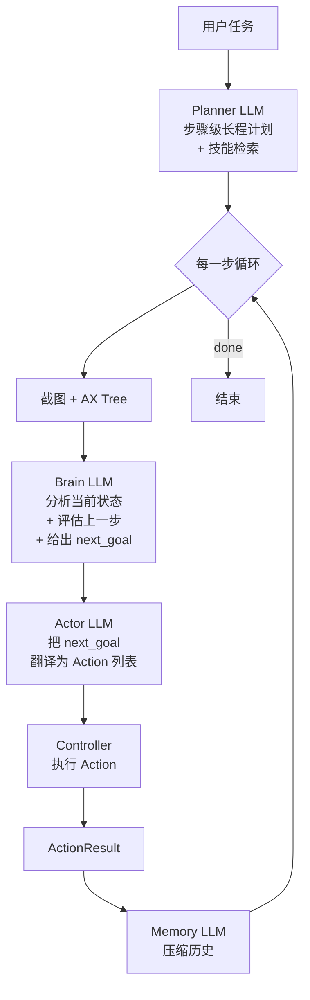

# TuriX-CUA 架构借鉴报告

> 阅读对象：[TurixAI/TuriX-CUA](https://github.com/TurixAI/TuriX-CUA) main 分支  
> 调研时间：2026-04-25  
> 仓库本地：`references/turix-cua/`（已加入 `.gitignore`）  
> Stars：2.5k · License：**MIT** · 语言：Python 97.8% · OSWorld 64.2% · OSWorld-style Mac 80%  
> 调研目的：对齐官方课题 §4.1 推荐与 FAQ Q4「鼓励站在巨人肩膀上创新」要求

---

## 1. 仓库整体结构

```
turix-cua/
├── examples/
│   ├── main.py            # 单文件入口；CLI 参数 + 配置加载 + 启动 Agent
│   └── config.json        # 4 个 LLM 角色 + agent 行为参数
├── src/
│   ├── agent/
│   │   ├── service.py     # 核心 Agent 类(1412 行)：Brain + Actor + Memory 编排
│   │   ├── planner_service.py  # Planner 类(577 行)：高层任务计划 + skill 检索
│   │   ├── prompts.py     # BrainPrompt / ActorPrompt / PlannerPrompt / MemoryPrompt
│   │   ├── output_schemas.py   # Pydantic 输出 schema
│   │   ├── views.py       # AgentBrain / AgentOutput / AgentHistory / ActionResult
│   │   ├── structured_llm.py   # 统一 LangChain LLM → 结构化输出适配
│   │   └── message_manager/    # 消息历史 + token 预算
│   ├── controller/
│   │   ├── service.py     # Controller(466 行)：Action 注册 + 调度执行
│   │   ├── views.py       # 各 Action 的 Pydantic 模型 (LeftClickPixel / InputText / Drag ...)
│   │   └── registry/      # Action 注册中心
│   ├── mac/
│   │   ├── actions.py     # macOS 原生 API 封装(Quartz / pyautogui)
│   │   ├── element.py     # AX 元素抽象
│   │   └── tree.py        # MacUITreeBuilder：Accessibility Tree 构建（混合定位）
│   └── utils/             # 记忆存储 / 搜索 / 技能加载 / token 计数
├── skills/                # 用户自定义 SOP（Markdown）
├── OpenCLaw_TuriX_skill/  # OpenClaw 集成包
└── doc/                   # 配图 + 文档
```

## 2. 核心架构：Brain / Actor / Memory / Planner 四角色

TuriX 不是简单的"Planner + Executor + Verifier"，而是**4 个 LLM 角色协同**：



### 各角色职责

| 角色 | LLM | 输入 | 输出 | 我们对应位置 |
|---|---|---|---|---|
| Planner | `planner_llm`（一次性，任务开始时） | 任务描述 + 技能目录 | 步骤级 Plan(JSON) | `agent/planner/` |
| Brain | `brain_llm`（每步）| 截图(前/后) + memory + plan | `analysis + step_evaluate + next_goal` | **`agent/planner/` 的步内规划 + `agent/verifier/` 的语义评估**——TuriX 把规划和验证融在一个 LLM 调用 |
| Actor | `actor_llm`（每步）| next_goal + 截图 | Action 列表（含**归一化坐标 0-1000**） | `agent/perception/grounder.py` + `agent/executor/` |
| Memory | `memory_llm`（按需）| 历史 step | 结构化摘要 | `agent/reporter/` 的 Trace 压缩部分 |

### 关键洞察

1. **Brain 把 Verifier 和下一步 Planner 合并**：每一步都"先评估上一步是否成功，再给下一步目标"。这比我们 v0.2 plan 中"Planner → Executor → Verifier 串行"更省一次 LLM 调用，**值得借鉴**。
2. **坐标归一化到 0-1000**：避免不同分辨率屏幕坐标解析错误，全程用相对坐标，最后只在执行端反归一化。**强烈建议我们采用**。
3. **Plan 和 Brain 解耦**：Planner 只跑一次（任务开始），Brain 每步跑——既保留了长程规划的全局视角，又避免每步都重新规划浪费 token。
4. **Memory 单独一个角色**：长任务历史压缩，避免 token 爆炸。

---

## 3. 值得直接借鉴的 6 个设计点

### 3.1 归一化坐标系（强推）

TuriX 的 Actor prompt 要求所有坐标输出为 `[0-1000, 0-1000]` 的归一化值，执行时再 ×屏幕分辨率反归一化。

**对我们的价值**：
- 解决 macOS Retina（物理 1512×982 vs 逻辑 756×491）的坐标混乱
- 不同测试机分辨率不一致时，Bench 结果可比
- 提示词可复用（无需告诉模型当前分辨率）

**实施成本**：低。改 `agent/perception/grounder.py` 的 system prompt + `agent/executor/mouse.py` 增加 `denormalize(x, y, screen_w, screen_h)` 即可。

### 3.2 Brain prompt 的"双截图比对"模式

```
"You will receive 1-2 images, if you receive 2 images, 
 the first one is the screenshot before last action, 
 the second one is the screenshot you need to analyze."
```

让 LLM 同时看「操作前截图」和「操作后截图」，自动做"操作是否生效"的对比。

**对我们的价值**：
- 这就是 plan §5.4 Verifier L3 的更优实现方式（不只看后图，要双图比对）
- 比单纯像素 Diff 更能捕捉**语义变化**

### 3.3 严格 JSON 输出 + Pydantic 校验 + 自动重试

`structured_llm.py` 把任意 LangChain LLM 包装成结构化输出：
- `ChatOpenAI` → `bind(response_format=...)`（OpenAI 协议）
- `ChatAnthropic` → `with_structured_output(...)`（Anthropic 协议）
- 不支持的模型 → 退化为 prompt-only JSON

**对我们的价值**：豆包 2.0 Pro 走 OpenAI 兼容协议，可以直接套这套机制。`agent/llm/doubao.py` 已经有 `response_format={"type": "json_object"}` 但缺**严格 schema 校验 + 失败重试**。可以加。

### 3.4 Action Registry + Pydantic Action 类

`controller/views.py` 把每个动作（点击/拖拽/输入...）都做成独立的 Pydantic 类：

```python
class LeftClickPixel(BaseModel):
    position: List[float] = Field(..., description="Coordinates (normalised) [x,y]")

class InputTextAction(BaseModel):
    text: str

class PressCombinedAction(BaseModel):
    key1: str
    key2: str
    key3: Optional[str] = None
```

LLM 直接输出这些 schema 的 JSON，Controller 自动 dispatch。

**对我们的价值**：
- 比我们当前 `Mouse.click(x, y)` 直接调用更优雅
- 支持 LLM 一次输出多动作列表，循环执行
- 加新动作只需加一个 Pydantic 类，零侵入

**强烈建议在 M2 引入**。

### 3.5 Skills 机制（SOP 注入）

TuriX 的 `skills/` 目录放 Markdown 写的"标准操作流程"（SOP），Planner 启动时检索相关 skills，注入 prompt。例如：

```markdown
# skill: feishu-im-send-message
1. 打开飞书 IM 界面
2. 在搜索框输入联系人或群聚名
3. 点击搜索结果
4. 在输入框点击并输入消息内容
5. 按 Enter 或点击发送按钮
```

**对我们的价值**：
- Bench 的标准用例集本身就是 SOP，可以双向复用
- 决赛 Demo 时可以演示"加新 skill = 加新测试场景"，**很有戏剧性**
- 对齐官方加分项「测试用例自动生成」

### 3.6 强制停止热键 + 故障保护

`force_stop_hotkey: "command+shift+2"` —— 答辩 Demo 现场必备的"急停"机制。

**对我们的价值**：现场翻车时一键停 Agent，避免乱点到飞书发出尴尬消息。**Demo 必备**。

---

## 4. 不直接借鉴的 4 个设计点

| 点 | 为什么不借鉴 |
|---|---|
| **macOS-only 的 Quartz/AX Tree 实现** | 我们要兼容 Windows（FAQ Q2 提到赛方提供 macOS/Windows 双环境）；AX Tree 也违反 Q3「核心决策必须基于视觉」红线 |
| **LangChain 全家桶**（langchain-openai/anthropic/google/ollama） | 重得不像话；我们只需要豆包，OpenAI 兼容 SDK 直调更轻 |
| **OpenClaw 集成** | 现阶段不需要；如果后期决定投 OpenClaw 子赛道再回头看 |
| **AppleScript Action** | 飞书 Electron 客户端没多少 AppleScript 接口可用 |

---

## 5. 关于"独立 Verifier"的设计选择

TuriX 把 Verifier 合并进 Brain，节省 LLM 调用。但我们 plan v0.2 §5.4 是**显式 Verifier 三层（L1 Diff + L2 OCR + L3 VLM）+ Oracle 校准**。

**两个方案对比**：

| 方面 | TuriX 风格（融合 Brain） | 我们 v0.2 风格（独立三层） |
|---|---|---|
| LLM 调用次数 | 每步 2 次（Brain + Actor） | 每步 3-4 次（Plan + Ground + L3 + 可选 Oracle） |
| 准确率 | 中（单 LLM 容易偏向自我肯定） | 高（多源投票，独立校准） |
| 可解释性 | 中 | 高（每层证据独立） |
| 评测可信度 | 中 | 高（Oracle 给金标准） |
| 工程复杂度 | 低 | 中 |

**结论**：保持我们的"独立三层 Verifier + Oracle 校准"路线，**因为这是答辩亮点**——
- 可以做对照实验：「TuriX 方案 vs LarkVision-Tester 方案」的准确率对比
- 评委会更买"诚实评测+多源投票"的账，单 LLM 自评在学术上不站得住

但**Brain 的"双截图比对"prompt 思路要吸收**到我们的 L3 Verifier 中。

---

## 6. 引用合规性（FAQ Q4 要求）

按 FAQ Q4：「可以基于现有开源项目二次开发，但需在文档中明确标注引用来源，并说明自研创新点」。

我们采用**「精神借鉴 + 接口参考 + 不直接 import 代码」**策略：

| 借鉴形式 | 内容 | 引用方式 |
|---|---|---|
| 架构思想 | 多 LLM 角色协同（Brain/Actor/Planner/Memory）| 在系统设计文档明确"借鉴 TuriX-CUA 多 Agent 架构（MIT, 2.5k stars）" |
| 设计模式 | 归一化坐标 0-1000、Action Pydantic、Skills 注入 | 同上，并附原始仓库 URL |
| Prompt 思路 | 双截图比对、严格 JSON、step_evaluate 字段 | prompt 文件加 docstring 注明思路来源 |
| 不引用代码 | 不直接 copy `src/agent/service.py` 等 | 自研重写，工程师亲自实现 |

**自研创新点**（与 TuriX 拉开差距的 4 件事）：

1. **针对飞书桌面 Electron 客户端的视觉适配**（中文 UI、密集图标、暗黑模式）
2. **三层视觉验证 + Oracle 校准的诚实评测体系**（TuriX 没有）
3. **跨产品联动 E2E 用例**（IM ↔ 日历 ↔ Docs）
4. **豆包 2.0 Pro 的 reasoning 档位路由**（TuriX 用 LangChain 包装，无此能力）

---

## 7. 立刻可落地的 6 个小改动（不用大动现有架构）

| # | 改动 | 文件 | 工作量 |
|---|---|---|---|
| 1 | 坐标归一化（0-1000）+ 反归一化 | `agent/perception/grounder.py` + `agent/executor/mouse.py` | 0.5d |
| 2 | Action Pydantic 类（取代直接函数调用） | 新建 `agent/executor/actions.py` | 0.5d |
| 3 | Brain prompt 双截图比对 | M2 写 `agent/verifier/semantic_check.py` 时加进去 | M2 顺手做 |
| 4 | 强制停止热键 | `agent/cli.py` + 主循环 | 0.3d |
| 5 | 严格 JSON schema 校验 + 重试 | `agent/llm/doubao.py` 加 `chat_structured()` | 0.5d |
| 6 | Skills 目录约定 | `skills/feishu-{im,calendar,docs}/*.md` | 1d（M2 起补） |

总计：~3d 增量，全在 M1-M2 阶段做完不影响主进度。

---

## 8. 后续动作建议

1. **本报告是临时调研产物**，最终精炼为系统设计文档（`docs/system_design.md`）的「相关工作 / 设计借鉴」章节
2. **本周内（M1）**：先落地小改动 1（归一化坐标）、4（急停热键），最直接降低 Demo 翻车风险
3. **M2 起**：落地小改动 2（Action Pydantic）、3（双截图）、5（结构化输出强校验）
4. **M3 起**：开始组织 `skills/` 目录，作为 Bench 用例的另一种载体

---

## 附录：关键文件清单（references/turix-cua/）

| 路径 | 说明 | 字数 |
|---|---|---|
| `examples/config.json` | 4 个 LLM 角色配置 + agent 参数（**配置最佳实践** 参考） | 短 |
| `examples/main.py` | 入口 + LLM 工厂（多 Provider 切换） | 中 |
| `src/agent/prompts.py` | **Brain/Actor/Planner/Memory 四个 system prompt 全文** | 450 行 |
| `src/agent/views.py` | AgentBrain/AgentOutput/AgentHistory schema | 237 行 |
| `src/agent/service.py` | 核心 Agent 主循环（最复杂） | 1412 行 |
| `src/agent/structured_llm.py` | LLM → 结构化输出适配 | 202 行 |
| `src/controller/views.py` | **每个 Action 的 Pydantic 类（直接抄）** | 70 行 |
| `src/controller/service.py` | Controller dispatch + 模糊 PID 匹配 | 466 行 |
| `src/agent/planner_service.py` | Planner（含技能检索 + 联网搜索） | 577 行 |
| `skills/github-web-actions.md` | 一个示例 skill SOP | 短 |

---

*报告由 Cursor Agent 调研产出 · 2026-04-25 20:55*
