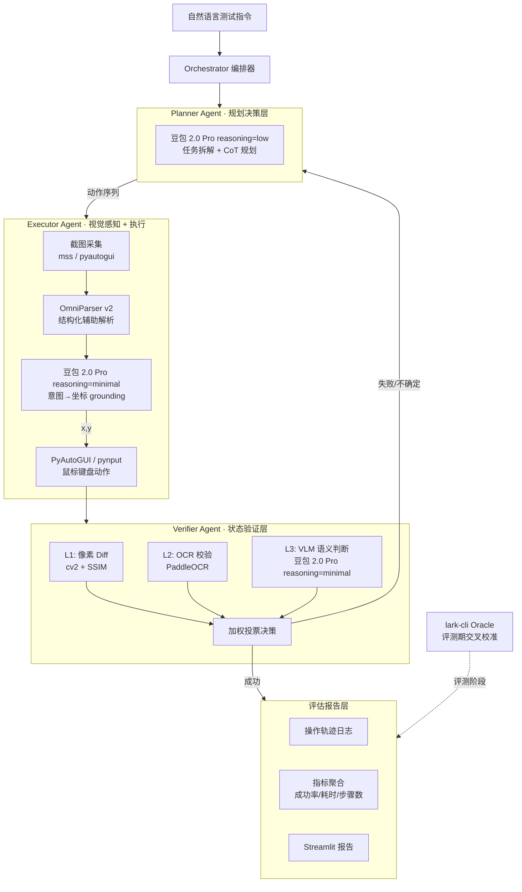
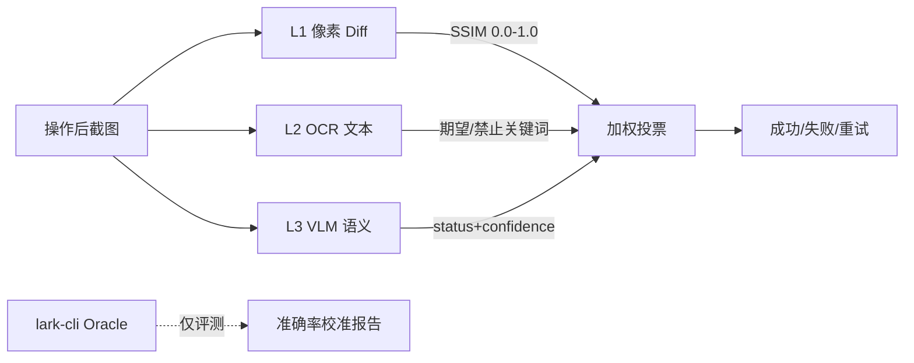

# CUA-Lark-15 方案 v0.2（对齐官方课题）

> 2026 飞书 AI 校园挑战赛 · **质量工程与智能测试方向** · 第 15 组  
> 创建日期：2026-04-25  
> 文档版本：v0.2（基于 [docs/课题背景.md](../docs/课题背景.md) 重写）  
> 最近修订：2026-04-25 17:36（确定主 VLM 为豆包 2.0 Pro）  
> 上一版：[2026-04-24-initial-plan.md](./2026-04-24-initial-plan.md)（保留作为历史快照）

---

## 0. 赛事信息（更新版）

| 项 | 内容 |
|---|---|
| 赛事 | 2026 飞书 AI 校园挑战赛 |
| **赛道** | **质量工程与智能测试方向**（CUA-Lark） |
| 一句话 | 用 CUA + 视觉多模态大模型，操作飞书桌面客户端，完成自动化功能测试与质量评估 |
| 组别 | 第 15 组（3 人组队） |
| 决赛答辩 | 2026-05-14（**15 分钟演讲 + 5 分钟 Q&A**） |
| 距决赛 | 2026-04-25 起算，约 **19 天** |
| 总奖池 | 8 万元现金 + 字节实习/Offer |
| 开发资源 | 火山方舟 Coding Plan（豆包 1.6 / 豆包 2.0 Pro 额度）、ArkClaw、飞书 API 测试号 |
| 测试环境 | 赛方提供标准化环境（macOS / Windows）；初赛可自带；飞书桌面客户端基于 Electron |
| 决赛 5 项交付物 | ① 系统设计文档 ② 源代码仓库 ③ 3-5 分钟 Demo 视频 ④ 评测报告 ⑤ 答辩 PPT |

> 红线（来自官方 FAQ Q3）：**核心操作决策必须基于视觉多模态理解，不可完全依赖结构化信息**（DOM / Accessibility Tree 仅可作辅助融合）。

---

## 1. 课题理解

### 1.1 三段背景（摘自官方课题）

- **CUA 技术趋势**：2025 年 OpenAI CUA / Anthropic Computer Use / 字节 UI-TARS 相继落地，CUA 进入产业化阶段
- **测试领域痛点**：传统 GUI 测试依赖 DOM/选择器，UI 一变就脆，成本巨大
- **飞书的理想性**：Electron 架构、IM/日历/Docs/Base/VC/Mail 多产品线、子产品联动频繁，是 CUA 落地测试的最佳实验场

### 1.2 我们解决什么

> 做一个**视觉驱动的飞书桌面端智能测试 Agent**——让它像真实用户一样"看屏幕、想策略、做操作、判结果、写报告"。

### 1.3 与 v0.1 的关键差异

| 维度 | v0.1（已废弃） | **v0.2** |
|---|---|---|
| 核心定位 | 飞书办公场景 Agent 助手 | **视觉驱动的 GUI 测试 Agent** |
| 主路径 | CLI 优先 + UI 兜底 | **视觉为主**，CLI 仅做评测期 Oracle 交叉校准 |
| 测试对象 | 飞书 Web/移动端 | **飞书桌面客户端（Electron）** |
| 创新点 | UI→CLI Skill 自合成 | **三 Agent 架构 + 三层视觉验证 + 自愈式执行** |

---

## 2. 项目定位：LarkVision-Tester

### 2.1 作品名

**LarkVision-Tester**：飞书桌面端视觉驱动智能测试 Agent

### 2.2 一句话

让 AI 像真实用户一样"看、想、做、验、报"，端到端完成飞书桌面客户端的功能测试与质量评估。

### 2.3 三大创新点

| # | 创新点 | 技术内核 | 评委看点 |
|---|---|---|---|
| 1 | **三智能体协同架构**（Planner / Executor / Verifier） | 模仿 TuriX-CUA 多 Agent 分工，规划与执行解耦、自愈反馈闭环 | 工程严谨、可扩展 |
| 2 | **三层视觉验证**（Diff + OCR + VLM 加权投票）+ Oracle 交叉校准 | cv2/SSIM + PaddleOCR + 豆包 2.0 Pro + lark-cli（仅评测） | 评测科学、判分准确 |
| 3 | **自愈式执行 + 跨产品联动 E2E** | 失败反思 → 替代路径；IM ↔ 日历 ↔ Docs 联动用例 | 对齐官方 §3.3 加分项 |

---

## 3. 系统架构（5 层，对齐官方 §3.1）

### 3.1 架构图



### 3.2 五层职责

| 层 | 职责 | 关键技术 |
|---|---|---|
| 视觉感知层 | 截图、UI 元素识别、坐标定位 | mss + OmniParser v2 + 豆包 2.0 Pro（reasoning=minimal） |
| 规划决策层 | 自然语言→动作序列、CoT、错误反思 | 豆包 2.0 Pro（reasoning=low/medium 动态切换） |
| 执行操作层 | 鼠标点击/拖拽/输入/快捷键 | PyAutoGUI + pynput（macOS 信任） |
| 状态验证层 | 操作后判断成败 | cv2/SSIM + PaddleOCR + 豆包 2.0 Pro（reasoning=minimal） |
| 评估报告层 | 指标聚合、轨迹回放、可视化 | JSON 日志 + Markdown 报告 + Streamlit |

---

## 4. 飞书子产品覆盖（≥3 个，对齐官方 §3.2 B）

### 4.1 覆盖矩阵（决赛目标）

| 子产品 | 用例数（M3 标杆 ≥2） | 测试场景 |
|---|---|---|
| **IM 即时通讯** ⭐ | 6 | 发文本/图片/文件、@提及、创建群、搜索消息、表情回复、撤回 |
| **日历 Calendar** ⭐ | 4 | 创建日程、邀请参会人、修改时间、查看忙闲 |
| **云文档 Docs** ⭐ | 4 | 新建文档、输入文本、插入标题/列表、分享 |
| 多维表格 Base（选） | 2 | 建表、添加字段、录入数据、切视图 |
| 视频会议 VC（选） | 2 | 发起会议、加入会议、开关麦/摄像头 |

⭐ = 决赛主推子产品（必交付）

### 4.2 跨产品联动 E2E 用例（加分项，1-2 条）

- **联动 1**：在 IM 收到日历邀请 → 跳日历确认 → 返回 IM 验证状态
- **联动 2**：Docs 创建周报文档 → 在 IM 群分享链接 → 验证消息送达

---

## 5. 技术选型

### 5.1 模型与工具

| 模块 | 主选 | 备选 | 理由 |
|---|---|---|---|
| 主 VLM（Planner / Grounder / Verifier） | **豆包 2.0 Pro**（doubao-seed-2.0-pro，4 档 reasoning 路由） | 豆包 1.6 | 视觉感知 SOTA、空间理解超 Gemini 3 Pro、长链路指令依从性强、最新旗舰 |
| 屏幕解析辅助 | **OmniParser v2** | 自研 YOLO | 开源、把截图先转成"按钮列表 + 坐标"，给 VLM 减负 |
| OCR | **PaddleOCR** | RapidOCR | 中文 SOTA |
| 像素 Diff | **OpenCV + scikit-image SSIM** | imagehash | 标准方案 |
| 操作执行 | **PyAutoGUI** + **pynput** | NutJS | Python 生态、跨平台、好集成 |
| 截图 | **mss** | pyautogui.screenshot() | 性能高、跨平台 |
| Agent 编排 | **LangGraph** | OpenAI Agents SDK | 状态机清晰、便于反思循环 |
| Oracle（评测期） | **@larksuite/cli** | lark-oapi SDK | 主办方自家工具 |
| 评测可视化 | **Streamlit** | Gradio | 起步快 |
| 开发语言 | **Python 3.11+** | — | 生态最成熟 |

### 5.2 模型架构选择说明

**为什么单豆包 2.0 Pro 一贯到底**：

1. **视觉感知 SOTA**：VLMsAreBlind / BabyVision / VLMsAreBiased 全榜冠军，飞书桌面端密集 UI 识别率最高
2. **空间理解超 Gemini 3 Pro**：MMSIBench / MotionBench 领先，4K 高分辨率屏幕的相对坐标定位更稳
3. **长链路指令依从性强**：Multi-Challenge / MCP-Mark 顶尖，多步骤测试用例（8-15 步）不容易跑偏
4. **中文综合能力榜首**（76.5%）：飞书桌面端中文界面密集，刚好对口
5. **2026-02-14 最新旗舰**：能力天花板高，评委也喜欢"用最新技术"
6. **官方资源到位**：火山方舟 Coding Plan 包含 2.0 Pro 额度
7. **架构最简**：单一模型、单一 API、单一 prompt 工程，3 周冲刺最稳

### 5.3 Reasoning 档位路由

豆包 2.0 Pro 支持 4 档 reasoning，按任务类型动态切档以平衡能力与延迟：

| 档位 | 估计延迟 | 适用任务类型 | 调用占比目标 |
|---|---|---|---|
| `minimal` | 3-8 秒 | Grounder（找坐标）、Verifier 简单语义判断 | **~70%** |
| `low` | 10-30 秒 | Planner 普通规划、复杂截图 grounding | **~25%** |
| `medium` | 1-2 分钟 | 跨产品联动规划、自愈反思 | **<5%** |
| `high` | 3-5 分钟 | （CUA 场景**禁用**，仅用于离线分析） | 0% |

**实现思路**（`agent/llm/router.py`）：

```python
class DoubaoRouter:
    def __init__(self):
        self.client = DoubaoClient("doubao-seed-2.0-pro")

    def call(self, task_type: str, **kwargs) -> dict:
        reasoning = {
            "grounding": "minimal",
            "simple_verify": "minimal",
            "planning": "low",
            "cross_product": "medium",
            "self_heal": "medium",
        }.get(task_type, "minimal")
        return self.client.chat(reasoning=reasoning, **kwargs)
```

**预留接口**：`LLMClient` 抽象层保留 Provider 切换能力，备选 fallback 路径：
- 豆包 2.0 Pro 在 4K 飞书界面上 grounding 仍不达标 → 挂 **UI-TARS-1.5（火山 API 版）** 作为 grounder
- 极简场景想加速 → 切 **豆包 1.6 thinking off**（保留 fallback 接口）

### 5.4 三层视觉验证设计



**加权规则（初稿）**：
- L3 confidence ≥ 90 → L3 独立决策
- 否则 `score = 0.2 * L1_pass + 0.3 * L2_pass + 0.5 * L3_pass`，> 0.5 判成功

**Oracle 用法**（不违反 Q3）：
- 开发期：**不用**，避免污染视觉训练
- 评测期：跑完 Bench 后用 `lark-cli` 复查后端真实状态，**校准三层视觉判分的准确率**
- 报告里写："视觉验证准确率 X% vs Oracle 真实结果"——诚实漂亮的评测结论

---

## 6. 里程碑（对齐官方 M1-M5）

剩 19 天，按官方推荐节奏推进：

| 里程碑 | 日期 | 天数 | 目标 | 验收标准 |
|---|---|---|---|---|
| **M1 单步操作** | 04-25 ~ 04-28 | 4d | 截图 → VLM → 单步点击/输入 | 飞书上完成 5 个单步操作 |
| **M2 流程串联** | 04-29 ~ 05-02 | 4d | 多步串联 + 状态验证 | IM 子产品 3 条 E2E 用例 |
| **M3 多产品覆盖** | 05-03 ~ 05-06 | 4d | 扩展 Calendar + Docs | 3 子产品 × 2+ 用例 |
| **M4 评估体系** | 05-07 ~ 05-10 | 4d | Bench + Oracle 校准 + 报告 | 自动统计成功率/耗时/步骤数；首份评测报告 |
| **M5 进阶优化** | 05-11 ~ 05-13 | 3d | 异常处理 + 自愈 + 跨产品联动 | ≥1 项加分能力可演示 |
| **决赛答辩** | **05-14** | — | 15+5 分钟答辩 | 5 项交付物完成 |

### 各里程碑关键产出

- **M1 完成**：`agent/executor/click.py`、`agent/perception/screenshot.py`、能跑 `python demo_click_send.py`
- **M2 完成**：`agent/planner/`、`agent/verifier/`、`tests/im_e2e_test.py`（3 条用例）
- **M3 完成**：`tests/calendar_e2e/`、`tests/docs_e2e/`，共 6+ 条用例
- **M4 完成**：`bench/runner.py`、`bench/oracle.py`、首份 Markdown 评测报告 + Streamlit Dashboard
- **M5 完成**：`agent/recovery/self_heal.py`、跨产品联动用例 1-2 条
- **决赛**：5 项交付物全部到位（详见 §10）

---

## 7. 项目目录规划

```
CUA-Lark-15/
├── README.md
├── plan/                              # 方案演进
│   ├── 2026-04-24-initial-plan.md     # v0.1 历史快照
│   └── 2026-04-25-v0.2-plan.md        # ← 当前
├── docs/                              # 课题资料 + 对外文档
│   ├── 课题背景.md
│   ├── 飞书AI校园大赛-个人阶段成果小结模版.md
│   └── system_design.md               # 决赛交付 ① 系统设计文档（M3 起草）
├── doc_auto/                          # workspace rule 要求的代码同步文档
├── agent/
│   ├── orchestrator.py                # LangGraph 顶层编排
│   ├── perception/                    # 视觉感知层
│   │   ├── screenshot.py              # mss 截图
│   │   ├── parser.py                  # OmniParser v2 调用
│   │   └── grounder.py                # 豆包 2.0 Pro grounding（reasoning=minimal）
│   ├── planner/                       # 规划决策层
│   │   ├── planner_agent.py
│   │   └── prompts.py                 # CoT prompt 模板
│   ├── executor/                      # 执行操作层
│   │   ├── mouse.py                   # 点击/拖拽/滚动
│   │   └── keyboard.py                # 输入/快捷键
│   ├── verifier/                      # 状态验证层
│   │   ├── pixel_diff.py              # L1
│   │   ├── ocr_check.py               # L2
│   │   ├── semantic_check.py          # L3
│   │   └── vote.py                    # 加权投票
│   ├── recovery/                      # M5 自愈
│   │   └── self_heal.py
│   ├── reporter/                      # 评估报告层
│   │   ├── trace.py
│   │   ├── metrics.py
│   │   └── dashboard.py               # Streamlit
│   └── llm/                           # LLM 抽象（多 Provider）
│       ├── base.py
│       └── doubao.py
├── bench/                             # 标准用例集 + 评测
│   ├── tasks/                         # YAML 用例
│   │   ├── im/
│   │   ├── calendar/
│   │   └── docs/
│   ├── runner.py
│   └── oracle.py                      # lark-cli 交叉校准
├── infra/
│   ├── env_setup.md                   # macOS / Windows 环境配置
│   └── feishu_install.md
├── demo/
│   ├── scenarios/                     # 答辩 Demo 脚本
│   └── video/                         # 录屏成品
├── tests/                             # 单元 + 集成（workspace rule 要求）
├── pyproject.toml
└── requirements.txt
```

---

## 8. 决赛 Demo 场景（3 个，对应 3-5 分钟视频）

### 场景 1：单产品 E2E 演示（IM）—— 60 秒
> 自然语言指令："在飞书 IM 中搜索群组'测试群'，发送一条消息'Hello World'，并确认发送成功"

展示：截图→VLM 规划→鼠标键盘→三层验证→成功标识。

### 场景 2：跨产品联动 —— 90 秒
> 指令："在 Docs 创建一个名为'2026Q2 项目周报'的新文档，输入标题，并把链接发到 IM 群'测试群'"

展示：Planner 拆 6 步 → Executor 执行 → Verifier L1/L2/L3 投票 → 跨产品状态衔接。

### 场景 3：自愈式执行（弹窗对抗）—— 60 秒
> 故意制造异常：执行中弹出"系统更新提示"。

展示：Verifier 发现意外弹窗 → Planner 反思 → 自动关闭弹窗 → 继续原任务。

> 合计 ~3.5 分钟，正好踩 3-5 分钟视频要求。

---

## 9. 风险与应对

| 风险 | 概率 | 影响 | 应对 |
|---|---|---|---|
| 豆包 2.0 Pro `medium` 档延迟过高（1-2 分钟/次） | 中 | 中 | 严格控制 `medium` 调用占比 < 5%；常规规划用 `low`、grounding 用 `minimal` |
| 豆包 2.0 Pro grounding 在 4K 飞书屏精度仍不达标 | 低 | 高 | 二步兜底：① OmniParser v2 提供候选框给 grounder 缩小搜索空间 ② 接 UI-TARS-1.5（火山 API 版）作为专用 grounder |
| 中文 OCR 在飞书图标识别失败 | 低 | 中 | PaddleOCR 兜底；高频图标做模板匹配 |
| Electron 客户端跨版本 UI 漂移 | 中 | 高 | 锁定一个飞书客户端版本（决赛前更新到与赛方一致） |
| 标准用例集赛方未明 | 高 | 高 | 自定 30 条用例覆盖 IM/Calendar/Docs，赛方一旦给标准就快速替换 |
| 火山方舟 token 配额用超 | 低 | 中 | Verifier L1+L2 通过则跳过 L3；缓存高频 prompt；批量场景用 batch API |
| 决赛环境 PyAutoGUI 权限 | 中 | 致命 | macOS 提前授予"辅助功能"权限；准备好 Windows 备机 |
| 答辩现场 Demo 翻车 | 中 | 致命 | 录好备播视频 + 本地离线 Demo + 重要场景预先 cache |

---

## 10. 决赛 5 项交付物 Checklist

| # | 交付物 | 要求 | 起草节点 | 负责模块 |
|---|---|---|---|---|
| 1 | **系统设计文档** | 架构图 + 模块说明 + 选型理由 + 数据流图 | M3 起草 → M4 完稿 | `docs/system_design.md` |
| 2 | **源代码仓库** | GitHub 完整代码 + README + 安装指南 | 持续提交 | 本仓库 + `infra/env_setup.md` |
| 3 | **Demo 视频** | 3-5 分钟，多个子产品操作能力 | M5 录制 | `demo/video/` |
| 4 | **评测报告** | 标准用例集完整数据 + 分析 | M4 起草 → M5 定稿 | `bench/report_*.md` |
| 5 | **答辩 PPT** | 15 分钟演讲 + 5 分钟 Q&A | M5 起草 | `demo/slides.pptx` |

---

## 11. 分工建议（3 人组，待组内确认具体认领）

| 角色 | 主要负责 | 备选职责 |
|---|---|---|
| **A · 视觉与执行** | Perception + Executor + LLM 抽象 | grounding 调优、PyAutoGUI 跨平台 |
| **B · 规划与验证** | Planner + Verifier + LangGraph 编排 | prompt 工程、自愈策略 |
| **C · 评测与交付** | Bench + Reporter + 设计文档 + PPT + Demo 视频 | Oracle 集成、Streamlit |

> 共担：用例编写、跨产品联动场景、答辩 Q&A 准备。

---

## 12. 下一步立即动作（D1: 04-25）

- [x] 写定 v0.2 plan
- [ ] 组内同步 v0.2 方向
- [ ] 项目骨架建出（按 §7）
- [ ] `pyproject.toml` 初始化（uv / poetry）
- [ ] 申请火山方舟豆包 2.0 Pro API Key（顺手开通豆包 1.6 作 fallback）
- [ ] 装飞书桌面客户端，记录版本号
- [ ] M1 第一个动作：跑通"截图 → 豆包 2.0 Pro（reasoning=minimal）识别飞书登录按钮 → 输出坐标"

---

## 附录 A：关键参考资料

| 类型 | 内容 |
|---|---|
| 官方课题 | [docs/课题背景.md](../docs/课题背景.md) |
| 推荐参考项目 | UI-TARS-desktop / UI-TARS / **TuriX-CUA**（多 Agent 架构核心参考）/ OSWorld |
| 推荐论文 | UI-TARS (ByteDance 2025) / OS Agents Survey (ACL 2025 Oral) / ScaleCUA (ICLR 2026 Oral) / GUI-R1 |
| 飞书资源 | 开放平台 https://open.feishu.cn/ ；客户端 https://www.feishu.cn/download |
| 火山方舟 | 模型列表 https://www.volcengine.com/docs/82379/1587798 ；豆包 2.0 Pro 文档参考火山引擎官网 |
| 模型 SDK | `volcengine-python-sdk[ark]` ；`@larksuite/cli` |

## 附录 B：待确认事项

1. 决赛是否使用赛方标准化测试环境（macOS / Windows）？组内开发应优先适配哪个？
2. 标准评测用例集是否赛方提供？还是各组自定？
3. 火山方舟 Coding Plan 的具体 token 配额？决赛阶段统一 API Key 何时下发？
4. 飞书桌面客户端是否锁定版本？官方有无指定版本号？
5. 答辩是线上还是线下？是否需要现场实机演示？

## 附录 C：v0.1 → v0.2 方向变更说明

| 项 | v0.1 | v0.2 | 变更原因 |
|---|---|---|---|
| 主路径 | CLI 优先 + UI 兜底 | **视觉为主**，CLI 仅作评测 Oracle | 官方 FAQ Q3 红线 |
| 作品名 | LarkAgent-X | **LarkVision-Tester** | 突出"视觉" + "测试"双关键词 |
| 创新点①（保留） | UI→CLI Skill 自合成 | 三 Agent 协同（Planner/Executor/Verifier） | 对齐 TuriX-CUA 参考项目 |
| 创新点②（保留） | FeishuCUA-Bench | 三层视觉验证 + Oracle 校准 | 突出测试方向 |
| 创新点③（新增） | — | 自愈 + 跨产品联动 | 对齐官方 §3.3 加分项 |
| 里程碑 | 自由 3 周拆分 | 对齐官方 M1-M5 | 评委预期 |
| 子产品覆盖 | 笼统"飞书办公" | IM + 日历 + Docs（≥3） | 对齐官方 §3.2 B |

## 附录 D：v0.2 内部修订日志

| 日期时间 | 改动 | 原因 |
|---|---|---|
| 2026-04-25 17:33 | v0.2 初版落盘 | 对齐官方课题文件 |
| 2026-04-25 17:36 | 主 VLM 由豆包 1.6 改为 **豆包 2.0 Pro**；新增 §5.3 Reasoning 档位路由；§9 风险表更新 | 不考虑价格因素后，2.0 Pro 视觉感知 SOTA + 空间理解超 Gemini 3 Pro，能力天花板更高 |

---

*v0.2 是相对完整的方案稿；后续若有重要调整，递增为 v0.3，文件名格式 `2026-MM-DD-v0.X-plan.md`。*
