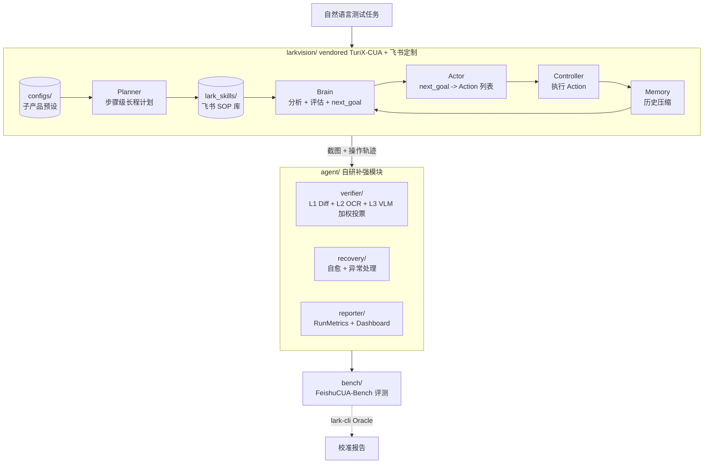

# CUA-Lark-15 方案 v0.3 (基于 TuriX-CUA 二开)

> 2026 飞书 AI 校园挑战赛 · **质量工程与智能测试方向** · 第 15 组  
> 创建日期：2026-04-27  
> 文档版本：v0.3 (路线变更)  
> 上一版：[2026-04-25-v0.2-plan.md](./2026-04-25-v0.2-plan.md)

---

## 0. v0.3 为什么变 (路线决策)

| 时间 | 状态 |
|---|---|
| v0.2 (4-25) | 自研 5 层架构, 18 单测过, 主 VLM 选豆包 2.0 Pro |
| 4-26 | **实际跑通**: 基于 TuriX-CUA + DashScope qwen3-vl-plus 完成飞书发消息 (3 步 65s) |
| v0.3 (4-27) | **战略转向**: 基于 TuriX-CUA 二开 + 自研补强模块, 而非完全重写 |

**核心判断**:
- TuriX-CUA 是 OSWorld 64.2% 的 SOTA 开源 CUA, MIT 协议, Python 实现, 可直接 BYOK
- 官方 FAQ Q4 鼓励"站在巨人肩膀上, 标注引用"
- 距决赛 17 天, 自研一套 SOTA 级 CUA 不现实, 二开 + 飞书专属适配 + 评测体系才是赢面
- 4-26 已经实测验证: TuriX 框架 + qwen3-vl-plus 在飞书桌面端可用

**最终定位调整**: 不再做"另一个 CUA 框架", 而是做**"飞书桌面端的 CUA 测试基准 + 飞书专属 Skill 库 + 三层视觉验证体系"**.

---

## 1. 新工程结构

```
CUA-Lark-15/
├── README.md                    # 项目门户
├── pyproject.toml               # 主仓 (uv-managed Python 3.11)
├── plan/                        # 方案演进
│   ├── 2026-04-24-initial-plan.md   # v0.1 历史
│   ├── 2026-04-25-v0.2-plan.md      # v0.2 自研路线 (废)
│   └── 2026-04-27-v0.3-plan.md      # ← 当前
│
├── larkvision/                  # 【新】vendored TuriX-CUA + 飞书定制
│   ├── UPSTREAM.md              #   引用与改造说明 (FAQ Q4 合规)
│   ├── LICENSE                  #   保留上游 MIT
│   ├── src/                     #   TuriX-CUA 源码 (commit 8f80ae6)
│   ├── examples/                #   入口 + 示例 config
│   │   └── config.json          #   ← 我们改成 DashScope qwen3-vl-plus
│   ├── configs/                 #   【新】不同子产品预设 config
│   │   └── lark_im_send.json    #   IM 发消息预设
│   ├── lark_skills/             #   【新】飞书专属 SOP
│   │   ├── README.md
│   │   ├── im/                  #   IM 即时通讯
│   │   ├── calendar/            #   日历
│   │   └── docs/                #   云文档
│   └── skills/                  #   保留上游样例 skills
│
├── agent/                       # 【自研】TuriX 的外挂式补强
│   ├── verifier/                #   ⭐ 三层视觉验证 (TuriX 没做)
│   │   ├── pixel_diff.py        #     L1 SSIM + 区域过滤
│   │   ├── ocr_check.py         #     L2 RapidOCR + 关键词
│   │   ├── vote.py              #     加权投票 (L3 高置信独立决策)
│   │   └── types.py             #     公共数据类型
│   ├── recovery/                #   M5 自愈式执行
│   ├── reporter/                #   ⭐ 评测报告 + Streamlit Dashboard
│   │   └── metrics.py           #     RunMetrics + summarize
│   └── planner/                 #   M2 起接 TuriX Brain 输出做高级编排
│
├── bench/                       # 【自研】FeishuCUA-Bench 评测体系
│   ├── tasks/                   #   YAML 用例集
│   │   └── im/im_send_text.yaml #     ← 复刻 4-26 跑通的发消息
│   ├── runner.py                #   M4 编写: 调 TuriX agent + 三层验证
│   └── oracle.py                #   M4 编写: lark-cli 后端校准
│
├── tests/                       # 单元测试 (M1 起补)
├── docs/
│   ├── 课题背景.md
│   ├── 官方课题信息.md
│   ├── turix_cua_review.md      # TuriX 调研报告 (4-25)
│   └── system_design.md         # 决赛交付 ① (M3 起)
├── doc_auto/architecture.md     # 代码同步文档 (workspace rule)
└── infra/env_setup.md           # 环境配置文档
```

## 2. 系统架构 (更新)



## 3. 模型与配置

(沿用 4-26 决策, 见 [[memory/2026-04-26]])

| 角色 | 模型 | thinking | 备注 |
|---|---|---|---|
| Brain | qwen3-vl-plus (DashScope) | off | brain_enable_thinking=false |
| Actor | qwen3-vl-plus | off | 同上 |
| Planner | qwen3-vl-plus | n/a | use_plan=false (短任务关闭高层 plan) |
| Memory | qwen3-vl-flash | n/a | 用 flash 压缩历史省钱 |

所有 LLM 配 `timeout: 45` 防 hang; 进程级 env `OPENAI_API_KEY` 注入, 不落 JSON.

**为什么不用豆包 2.0 Pro**: 4-26 实测 qwen3-vl-plus 已经够用且配额到手; 决赛后期可双轨对照实验 (qwen vs 豆包) 写进评测报告作为差异化亮点.

## 4. 核心创新点 (FAQ Q4 自研部分)

| # | 创新点 | 文件 | TuriX 是否有 |
|---|---|---|---|
| 1 | **三层视觉验证 + 加权投票** | `agent/verifier/{pixel_diff,ocr_check,vote}.py` | ❌ 没有 (Brain 自评) |
| 2 | **lark-cli Oracle 评测期校准** | `bench/oracle.py` (M4) | ❌ 没有 |
| 3 | **FeishuCUA-Bench 标准用例集** | `bench/tasks/{im,calendar,docs}/*.yaml` | ❌ 没有 |
| 4 | **飞书专属 Skills 库** | `larkvision/lark_skills/{im,calendar,docs}/*.md` | ❌ 上游只有 GitHub 样例 |
| 5 | **跨产品联动 E2E 用例** | `bench/tasks/cross/*.yaml` (M5) | ❌ 没有 |
| 6 | **Streamlit 评测 Dashboard** | `agent/reporter/dashboard.py` (M4) | ❌ 没有 |

**借鉴自 TuriX 的部分** (UPSTREAM.md 中明确标注):
- Brain / Actor / Planner / Memory 4 角色架构
- 归一化坐标 0-1000
- AppleScript 动作 + Pydantic Action Registry
- imperative step-by-step prompting (4-26 实战验证)

## 5. 里程碑 (剩 17 天)

| 里程碑 | 日期 | 目标 | 验收 |
|---|---|---|---|
| ✅ M1 单步操作 | -04-28 | TuriX 飞书发消息 | 4-26 已通过 |
| M2 流程串联 | 04-28 ~ 05-01 | IM 子产品 3+ 用例 + verifier L1/L2 接入 | `bench/tasks/im/*.yaml` 跑通 |
| M3 多产品覆盖 | 05-02 ~ 05-05 | 日历 + Docs 各 2+ 用例 + lark_skills 完整 | `bench/tasks/{calendar,docs}/` |
| M4 评估体系 | 05-06 ~ 05-09 | bench/runner + oracle + dashboard | 首份评测报告 (Markdown + Streamlit) |
| M5 进阶优化 | 05-10 ~ 05-13 | 自愈 + 跨产品联动 + qwen vs 豆包对照 | ≥1 项加分能力 + 对照报告 |
| 决赛答辩 | **05-14** | 5 项交付物 | 系统设计文档 + 源码 + Demo 视频 + 评测报告 + PPT |

## 6. 立即动作 (今晚)

- [x] vendor TuriX 进 `larkvision/` + UPSTREAM.md 合规
- [x] 删自研重复的 llm/ perception/ executor/ 模块
- [x] 写 verifier 三层骨架 (pixel_diff / ocr_check / vote)
- [x] 创建 lark_skills/ + configs/ 目录
- [x] 写 bench 第一个 YAML 用例 (复刻 4-26 发消息)
- [x] plan v0.3 落盘 (本文)
- [ ] 主仓 pyproject.toml 同步: 删豆包/PyAutoGUI 依赖, 加 RapidOCR / scikit-image
- [ ] 跑 pytest + ruff 验证
- [ ] commit 整个变更作为一个 v0.3 路线 milestone

## 7. 风险与应对

| 风险 | 应对 |
|---|---|
| qwen3-vl-plus 单次 50-60s 偶发慢 (memory 已记) | timeout=45 + max_failures=5 容错; 答辩 demo 用录屏兜底 |
| qwen3-vl-plus grounding 弱 (memory 已记) | 飞书任务全用 imperative + AppleScript + input_text 兜底, 不让 actor 戳坐标 |
| TuriX 上游有 breaking change | UPSTREAM.md 锁定 commit 8f80ae6, 决赛期不跟随上游 |
| FAQ Q4 引用合规 | UPSTREAM.md + 系统设计文档明确标注; 4 个自研创新点撑住"独创性"门槛 |
| 时间不够 | M3-M5 每个用例都用 lark_skills 套子, 复用度高; bench 任务从 12 降到 6 也能交付 |

## 8. 决赛 5 项交付物对应位置

| # | 交付物 | 路径 | 起草节点 |
|---|---|---|---|
| 1 | 系统设计文档 | `docs/system_design.md` | M3 起草 |
| 2 | 源代码仓库 | 本仓 + larkvision/UPSTREAM.md | 持续 |
| 3 | Demo 视频 | `demo/video/` | M5 录制 |
| 4 | 评测报告 | `bench/output/report_*.md` + Streamlit | M4 |
| 5 | 答辩 PPT | `demo/slides.pptx` | M5 |

---

## 附录 A：v0.2 → v0.3 变更总览

| 项 | v0.2 | v0.3 |
|---|---|---|
| 主架构 | 完全自研 | **基于 TuriX-CUA 二开** |
| 主 VLM | 豆包 2.0 Pro | **qwen3-vl-plus** (4-26 实测; 后期可双轨对照) |
| Operator | PyAutoGUI 自研 | **TuriX Controller** (含 AppleScript) |
| 验证层 | 自研 (但还没动) | ✅ 自研三层 (pixel_diff + ocr + vote) **保留** |
| Bench | 设计中 | 框架不变 + 用例首版到位 |
| LLM 抽象层 | 自研 LLMRouter | **删** (TuriX LangChain 全家桶覆盖) |
| Perception | 自研 grounder | **删** (TuriX Brain+Actor 直出坐标) |
| Executor | 自研 mouse/keyboard | **删** (TuriX controller + mac 原生 API) |
| 风险 | 时间不够自研 SOTA | **大幅降低** (站在 64.2% OSWorld 基础上) |
| 工程量 (剩 17 天) | 高 | **中** (聚焦自研创新点 + 飞书定制) |

## 附录 B：当前文件清单 (Phase 1-4 落盘后)

```
新增/重写:
  larkvision/                          (vendored from TuriX 8f80ae6)
  larkvision/UPSTREAM.md               (FAQ Q4 合规)
  larkvision/configs/lark_im_send.json
  larkvision/lark_skills/README.md
  larkvision/lark_skills/im/im_send_text.md
  agent/__init__.py                    (重写: 标注为补强模块)
  agent/verifier/__init__.py
  agent/verifier/types.py
  agent/verifier/pixel_diff.py
  agent/verifier/ocr_check.py
  agent/verifier/vote.py
  agent/reporter/metrics.py
  bench/tasks/im/im_send_text.yaml
  plan/2026-04-27-v0.3-plan.md         (本文)

删除:
  references/turix-cua/                (整目录, 已物理迁移)
  agent/llm/                           (TuriX LangChain 已覆盖)
  agent/perception/                    (TuriX Brain+Actor 已覆盖)
  agent/executor/                      (TuriX Controller 已覆盖)
  agent/cli.py                         (用 larkvision/examples/main.py)
  demo/m1_grounding_demo.py            (M1 已用 TuriX 跑通)
  tests/test_grounder.py               (对应 perception 已删)
  tests/test_llm_base.py               (对应 llm 已删)
  tests/test_router.py                 (对应 router 已删)
```
